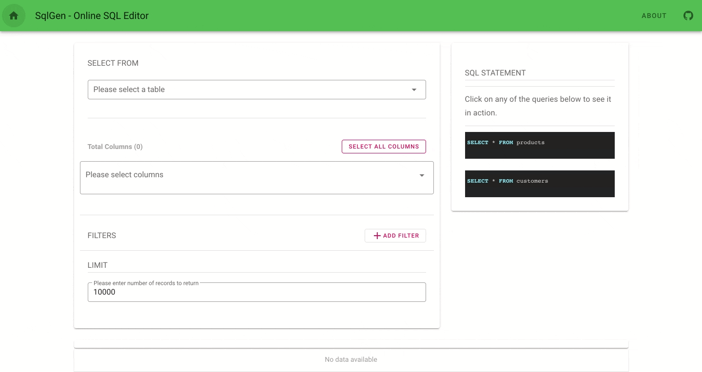
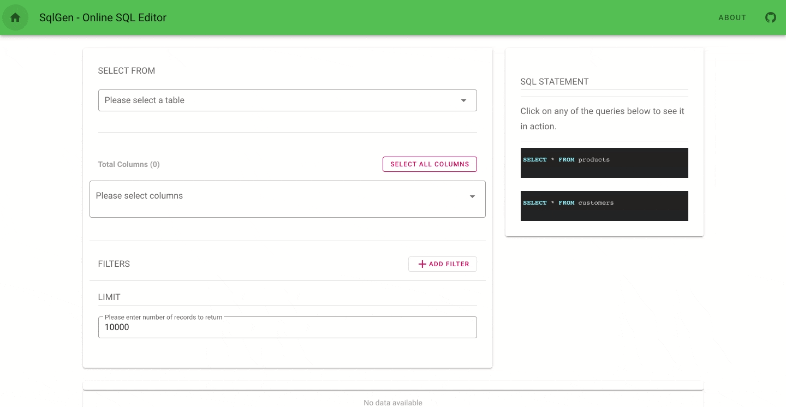

# SqlGen - An online SQL Query generator

An online sql editor made with [nuxt](https://nuxtjs.org/), [vuetify](https://vuetifyjs.com/en/), [nuxt-content](https://github.com/nuxt/content) and [highlight.js](https://highlightjs.org/) for syntax highlighting.

## Build Setup

```bash
# install dependencies
$ npm install

# serve with hot reload at localhost:3000
$ npm run dev

# build for production and launch server
$ npm run build
$ npm run start

# generate static project
$ npm run generate
```

For detailed explanation on how things work, check out [Nuxt.js docs](https://nuxtjs.org).

# Demo



## Demo - running predefined queries


